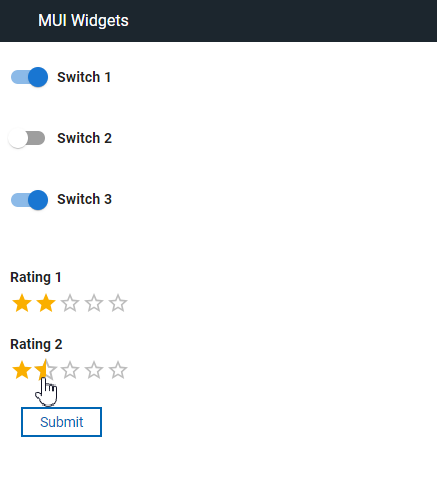

# HCL Leap - Custom Widgets

*HCL Leap* and *HCL Domino Leap* can be augmented with your own custom widgets.  These can be written from scratch or can wrap components from other common libraries. 

## API
The **Custom Widget API** is described in the **Reference** section of the product documentation:
  - [Leap 9.3.5](https://opensource.hcltechsw.com/leap-doc/9.3.5/customwidgetapi_landing.html)
  - [Leap 9.3.4](https://help.hcltechsw.com/Leap/9.3.4/customwidgetapi_landing.html)
  - [Domino Leap 1.1.3](https://help.hcltechsw.com/domino-leap/1.1.3/customwidgetapi_landing.html)

## Samples
Various samples are available in the [Samples](./samples) directory.  
For example:

