# ChartJS Widget

A sample widget that displays an SVG-based based on the [ChartJS package](https://www.chartjs.org/https:/).
The widget is completely programmable. It only supports one dataset.

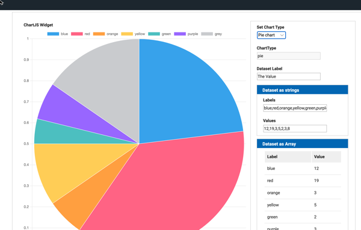

The widget is a **Display Widget**, so it does not hold data by itself but can be used to display data coming from other widgets.

When the widget is instantiated at runtime, it gets a unique HTML ID following this convention: `chartJS_' + Date.now()`.

## Widget Properties and events

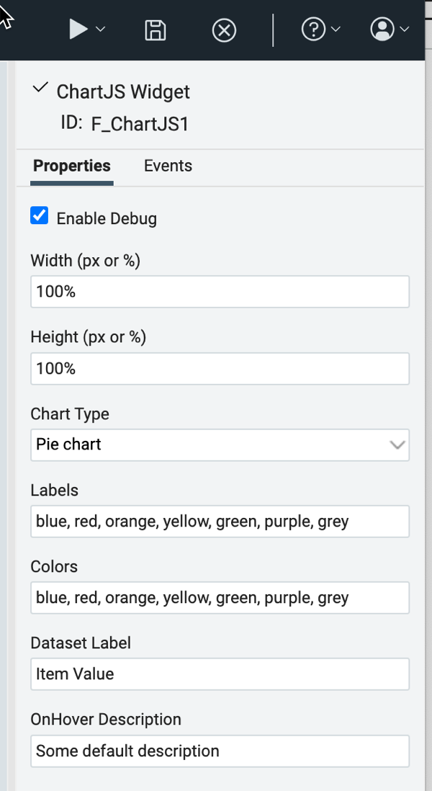

### Properties

---

* **Enable Debug**
  When set, verbose output is generated on the browser console

  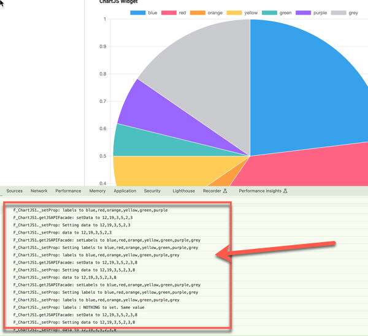
* **Width**

  The *width* of the widget can be modified on respect to its default values. The *width* can be expressed as "**px**" or as "**percentage**". Please be sure to use the following format:

  * `<integer>px` when using "pixels" (for instance 100px or 50px...)
  * `<integer>%`when using "percentage" (for instance 100% or 20%). The percentage is on respect to the grid cell containing the **chartJS widget**: thus `100%` means that the widget takes all the width of the grid cell.
* **Height**
  The *height* of the widget can be modified on respect to its default values. The *height* can **only** be expressed as "**px**" or as "**percentage**". Please be sure to use the following format:

  * `<integer>px` when using "pixels" (for instance 100px or 50px...)
  * `<integer>%` when using "percentage" (for instance 100% or 20%). The percentage is on respect to the grid cell containing the **chartJS widget**: thus `100%` means that the widget takes all the height of the grid cell.
* **Chart Type**
  The form Author can chose among the following values from the droplist:

  * **Pie Chart** : the default

    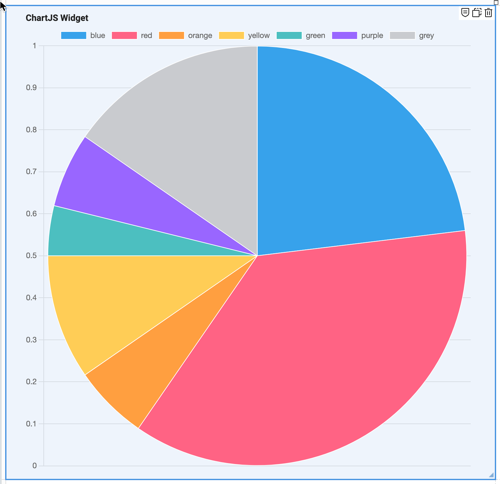
  * **Donut**

    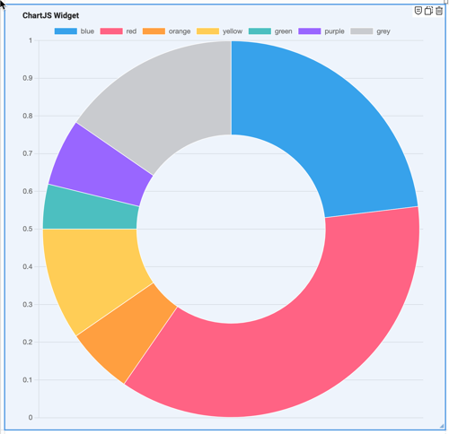
  * **Bar Chart**

    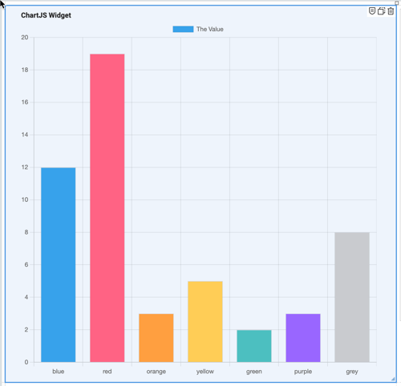
  * **Line Chart**

    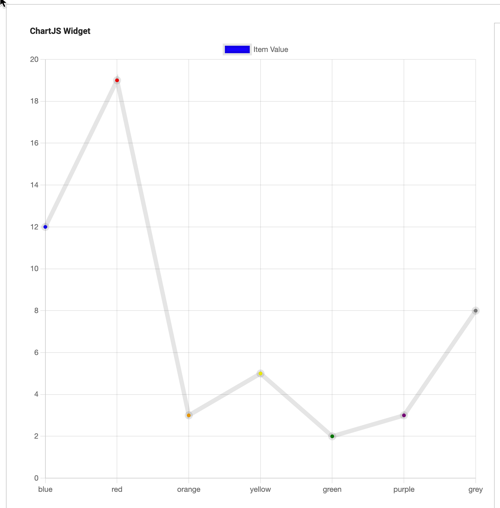
  * **Polar**

    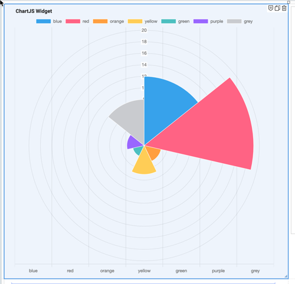
* **Labels**
  This is a comma-separated list of strings which are assigned to the dataset.
  The default is `"blue, red, orange, yellow, green, purple, grey"`.
* **Colors**
  This is a comma-separated list of strings which are used to define the dataset colors.
  The default is `"blue, red, orange, yellow, green, purple, grey"`. You can use the "text" representation of the color.
  The colors will be re-used if the dataset counts more elements than the list of colors. For exemple:

  * if you want all the data to be drawn with the same color, then it will be enough to provide one single color in the list
  * if you want two colors to be used alterntively for the data in the dataset, then the list should count only two colors
* **Dataset Label**
  The data that are shown in the chart reference some real quantity. The **Dataset Label** is the label you want to associate to that quantity.

  * The label is, normally, visualized on hovering over each element, as shown in the image below (where the **Dataset Label** is `"The Value"`) :

    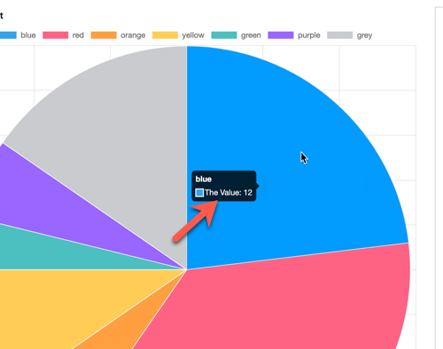
  * the label is, also, shown on the top of the chart for the chart types **"Line Chart"** and **"Bar Chart"** as shown below (where the **Dataset Label** is `"The Value"`):

    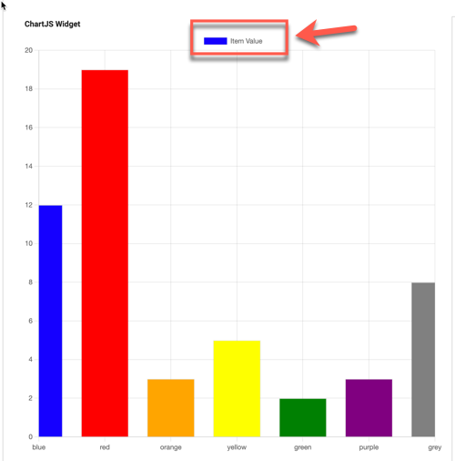
* **OnHover Description**
  A string that appears when the user passes the mouse "over" the widget

### Events

---

The widget honors the **click event**. In this way, the form Author can assign some custom behavior when the form User clicks on the widget.

### Programming the ChartJS Widget

---

The following APIs allow the Author to programmatically perform the following operations:

- `getDisplayTitle() / setTitle(string)`
  Gets and sets the title of the widget
- `getData() / setData(comma-separated list of strings)`
  Gets the dataset values currently shown by the widget and Sets the dataset values shown by the widget
- `getLabels() / setLabels(comma-separated list of strings)`
  Gets and sets the value of the **Labels** corresponding to dataset values shown by the widget
- `getDatasetLabel() / setDatasetLabel(cstring)`
  Gets and sets the **Label** for to dataset shown by the widget
- `getColors() / setColors(comma-separated list of strings)`
  Gets and sets the names of the **Colors** corresponding to dataset values shown by the widget
- `getChartType() / setChartType(string)`
  Programmatically gets or set the current chart type. The values to be used are the following


  | value     | chart type  |
  | ----------- | :------------ |
  | doughnut  | Donut       |
  | pie       | Pie Chart   |
  | bar       | Bar Chart   |
  | line      | Line Chart  |
  | polarArea | Polar Chart |
- `getChartTypes()`
  Returns a comma-separated string listing all the available **Chart Types** (see previous table).
- `getWidth() / setWidth(string)`
  Gets and sets the **width** of the **chartJS widget**. For the widget's **width**, please be sure to use the following format:

  - `<integer>px` when using "pixels" (for instance 100px or 50px...)
  - `<integer>%`  when using "percentage" (for instance 100% or 20%). The percentage is on respect to the grid cell containing the **chartJS widget**: thus `100%` means that the widget takes all the width of the grid cell.
- `getHeight() / setHeight(string)`
  Gets and sets the **height** of the **chartJS widget**. For the widget's **height**, please be sure to use the following format:

  - `<integer>px` when using "pixels" (for instance 100px or 50px...)
  - `<integer>%`  when using "percentage" (for instance 100% or 20%). The percentage is on respect to the grid cell containing the **chartJS widget**: thus `100%` means that the widget takes all the height of the grid cell.
- `getDebugFlag() / setDebugFlag(boolean)`
  Gets and sets the *Debug flag* for the widget instance

## Build

In case you need/want to modify and rebuild the widget, please follow these steps:

1. Install `git` and `npm`  (consult the internet)
2. Open git bash console
3. Clone this repo. For example:
   `git clone https://github.com/HCL-TECH-SOFTWARE/leap-custom-widgets.git`
4. `cd leap-custom-widgets/samples/chart-widget`
5. `npm install`
6. `npm run build`

The output of the build will be in the `dist/` directory.
If you wish to make code changes to the sample, use `npm build-watch` to have the files building continuously. Refresh the browser to see recent changes.

## Run

Take the `chartJS.js`and `chartJS.css` files from the `dist/`directory and and place them onto a web server.

- **HCL Leap** configuration
  Add the following to `Leap_config.properties`:

```properties
ibm.nitro.NitroConfig.runtimeResources.1 = \
<link rel='stylesheet' type='text/css' media='screen' href='http://127.0.0.1:5501/leap-custom-widgets/samples/chart-widget/dist/chartJS.css'> \n\
<script type='text/javascript' src='http://127.0.0.1:5501/leap-custom-widgets/samples/chart-widget/dist/chartJS.js'></script>
```

- **HCL domino Leap** configuration
  *HCL Domino Leap* configuration is done similarly by adding a config setting in `VoltConfig.nsf`.

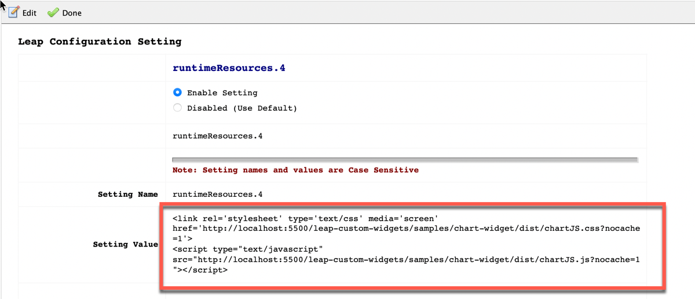

## Credits
