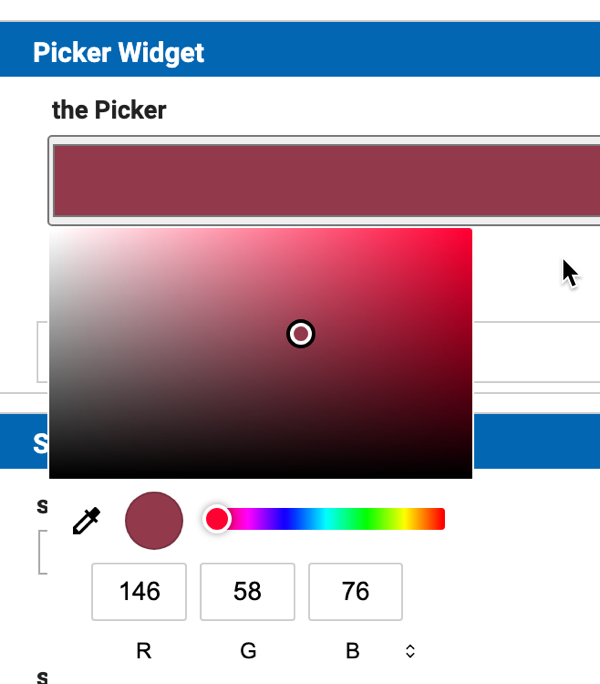
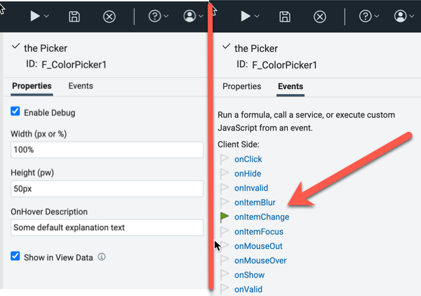
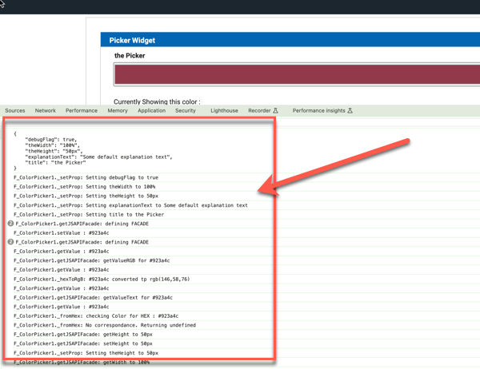
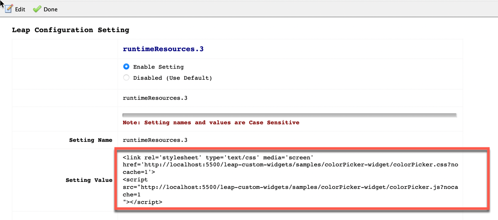

# Color Picker Widget

A sample widget that uses the [HTML Color Picker element](https://www.w3schools.com/colors/colors_picker.asphttps:/) for the currently used browser.  
The widget is completely programmable



Above picture shows the rendering on the Chrome Browser on MacOS.

The widget is a **Data Widget**, and the value that it manages is the string representation of the color. This string is fully managed by the HTML widget and it is stored in **HCL Leap / HCL Domino **Leap as its hexadecimal representation.

When the widget is instantiated at runtime, it gets a unique HTML ID following this convention: `'coloPicker' + Date.now()`.

## Widget Properties and events



### Properties

---

* **Enable Debug**  
  When set, verbose output is generated on the browser console

  
* **Width**  
  The *width* of the widget can be modified on respect to its default values. The *width* can be expressed as "**px**" or as "**percentage**". Please be sure to use the following format:

  * `<integer>px` when using "pixels" (for instance 100px or 50px...)
  * `<integer>%`when using "percentage" (for instance 100% or 20%). The percentage is on respect to the grid cell containing the color-picker: thus `100%` means that the widget takes all the width of the grid cell.
* **Height**  
  The *height* of the widget can be modified on respect to its default values. The *height* can **only** be expressed as "**px**" using the format`<integer>px`(for instance 100px or 50px...)
* **OnHover Description**  
  A string that appears when the user passes the mouse "over" the widget

### Events

---

The widget honors the **onChange event**. In this way, the form Author can assign some custom behavior when the form User selects a different color.

### Programming the Color Picker Widget

---

The following APIs allow the Author to programmatically perform the following operations:

- `getDisplayTitle() / setTitle(string)`  
  Gets and sets the **title** of the widget
- `getValue() / setValue(string)`  
  Gets the **value** of the widget and Sets its value.  
  - When setting the value of the color, the value itself can be expressed as RGB, HEXadecimal or "Text" string as explained [here](#summary-of-the-color-properties)
  - When getting the value of the color using the `getValue() `function, it always returns an HEXadecimal string.
- `getValueRGB()`  
  Gets the **RGB** representation of the Widget's value in the form `rgb(int, int, int)`
- `getValueText()`  
  Gets the **Text** representation of the Widget's value (for instance 'red', or 'black', or 'cyan' or 'lightblue'...)
- `convertToHex(string)`  
  Converts an **RGB** or **Text** representation of a color to its **HEXadecimal** counterpart.
- `getWidth() / setWidth(string)`  
  Gets and sets the **width** of the Color-Picker **widget**. For the widget's **width**, please be sure to use the following format:  
  - `<integer>px` when using "pixels" (for instance 100px or 50px...)
  - `<integer>%`  when using "percentage" (for instance 100% or 20%). The percentage is on respect to the grid cell containing the color-picker: thus `100%` means that the widget takes all the width of the grid cell.
- `getHeight() / setHeight(string)`  
  Gets and sets the **width** of the Color-Picker **height**. For the widget's **height**, please be sure to use the format`<integer>px`(for instance 100px or 50px...)
- `getDebugFlag() / setDebugFlag(boolean)`  
  Gets and sets the *Debug flag* for the widget instance

### Summary of the color properties

---

Each color can be expressed as RGB, HEXadecimal or "Text" according to the following syntax:

* ***RGB***: rgb(int, int, int)
* ***HEX***: #HHHHHH
* ***Text***: "*lightblue*", "*red*", "*cyan*" ... or any valid textual value
  * Not all colors have a **Text** representation

## Run

Take the `colorPicker.js`and `colorPicker.css` files and place them onto a web server.

- **HCL Leap** configuration
  Add the following to `Leap_config.properties`:  
```properties
ibm.nitro.NitroConfig.runtimeResources.1 = \
<link rel='stylesheet' type='text/css' media='screen' href='http://127.0.0.1:5501/leap-custom-widgets/samples/colorPicker-widget/colorPicker.css'> \n\
<script type='text/javascript' src='http://127.0.0.1:5501/leap-custom-widgets/samples/gauge/colorPicker-widget/colorPicker.css'></script>
```

- **HCL domino Leap** configuration  
  *HCL Domino Leap* configuration is done similarly by adding a config setting in `VoltConfig.nsf` :


  

## Credits
