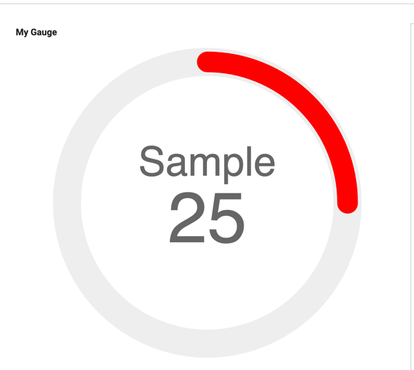
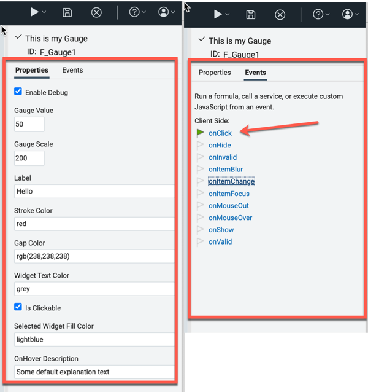
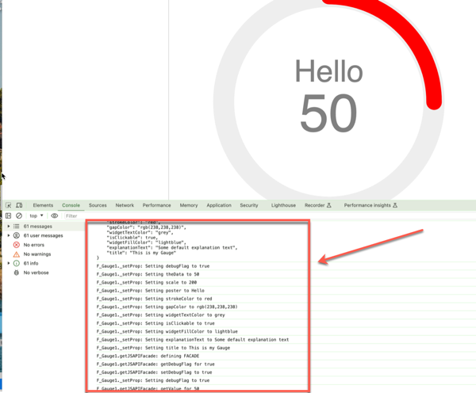
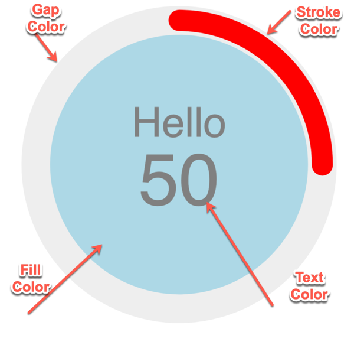
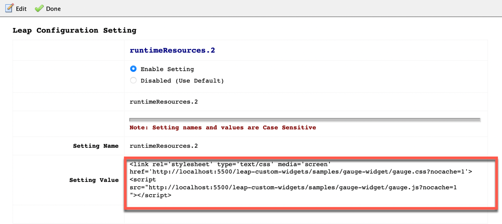

# Gauge Widget

A sample widget that displays an SVG-based, completely programmable "Gauge" widget.



The widget is a **Display Widget**, so it does not hold data by itself but can be used to display data coming from other widgets.  
When the widget is instantiated at runtime, it gets a unique HTML ID following this convention: `gauge_' + Date.now()`.

## Widget Properties and events



### Properties

---

* **Enable Debug**  
  When set, verbose output is generated on the browser console

  
* **Gauge Value**  
  Even if this is a "*Display Widget*", this property allows to initialize the value shown in the Gauge.
  Positive integer only.
* **Label**  
  This is the text that is displayed at the middle of the widget.
* **Gauge Scale**  
  The "*Gauge Value*" needs to be relative to a "scale".
  For instance, a "*Gauge Value*" of 25 on a "*Gauge Scale*" of 100 will display a quarter of a circle strikeout.
  Positive integer only.
* **Stroke color**  
  The color of the "stroke", the part of the widget showing the visualization of the value. See the section ["Summary of the color properties"](#summary-of-the-color-properties) below.
* **Gap color**  
  The color of the "gap", the part of the widget that completes the "*stroke*". See the section ["Summary of the color properties"](#summary-of-the-color-properties) below.
* **Widget Text Color**  
  This is the color used to display the "*Label*" and the "*Gauge Value*". See the section ["Summary of the color properties"](#summary-of-the-color-properties) below.
* **Selected Widget Fill color**  
  When the widget is clicked, the background color changes to visually represent the fact that the widget has been selected. See the section ["Summary of the color properties"](#summary-of-the-color-properties) below.
* **Is Clickable**  
  When this property is set, the user can click the widget (and this will trigger a change in the background color).
  In addition to the background color change, the "**click**" event is triggered which can be captured by the widget's **onClick** event handler (where the form Author can add custom code).
  If this property is not set, the widget will not deliver the "onClick" event nor the background color of the widget will change.
* **OnHover Description**  
  A string that appears when the user passes the mouse "over" the widget

### Events

---

The widget honors the **click event**. In this way, the form Author can assign some custom behavior when the form User clicks on the widget.  
The default behavior is that the widget changes the "fill color" (see the section ["Summary of the color properties"](#summary-of-the-color-properties) below). Clicking twice resets the "fill color" to the default one.

The click event can be statically and/or dynamically blocked by means of:  
* the **Is Clickable** property available during the editing of the widget
* the `selectWidget()` API

### Programming the Gauge Widget

---

The following APIs allow the Author to programmatically perform the following operations:

* `getTitle() / setTitle(string)`  
  Gets and sets the title of the widget  
* `getValue() / setValue(positive integer)`  
  Gets the value currently shown by the widget and Sets the value shown by the widget  
* `getLabel() / setLabel(string)`  
  Gets and sets the value of the Label shown inside the circle of the Gauge widget  
* `getScale() / setScale(positive integer)`  
  Gets and sets the scale of the Gauge in order to correctly represent the value  
* `getTextColor() / setTextColor(string)`  
  Gets and sets the color of the "*value*" and of the "*label*" of the widget  
* `getStrokeColor() / setStrokeColor(string)`  
  Gets and sets the color of the "*stroke*" of the widget  
* `getGapColor() / setGapColor(string)`  
  Gets and sets the color of the "*gap*" of the widget  
* `getFillColor() / setFillColor(string)`  
  Gets and sets the color of the "*background*" of the Gauge when it is selected  
* `getClickable() / setClickable(boolean)`  
  Gets and sets the *clickable-state* of the widget  
* `selectWidget() / unselectWidget()`  
  Programmatically selects or unselects the widget. It has the same behavior has clicking on the widget.  
  These operaions do not yield any result in case the widget is in a *non-clickable state*.  
* `isWidgetSelected()`  
  Returns **true** in case the widget is selected or **false** in case the widget is not selected  
* `toggleSelection()`  
  It toggles the selection of the widget **on** or **off**  
* `getDebugFlag() / setDebugFlag(boolean)`  
  Gets and sets the *Debug flag* for the widget instance  

### Summary of the color properties

---

Each color can be expressed as RGB, HEXadecimal or "Text" according to the following syntax:  
* ***RGB***: rgb(int, int, int)
* ***HEX***: #HHHHHH
* ***Text***: "*lightblue*", "*red*", "*cyan*" ... or any valid textual value
  * Not all colors have a **Text** representation

Here a **short summary of the colors attributes** used by the Widget:


## Run

Take the `gauge.js`and `gauge.css` files and place them onto a web server.

- **HCL Leap** configuration
  Add the following to `Leap_config.properties`:  
```properties
ibm.nitro.NitroConfig.runtimeResources.1 = \
<link rel='stylesheet' type='text/css' media='screen' href='http://127.0.0.1:5501/leap-custom-widgets/samples/gauge-widget/gauge.css'> \n\
<script type='text/javascript' src='http://127.0.0.1:5501/leap-custom-widgets/samples/gauge-widget/gauge.js'></script>
```

- **HCL domino Leap** configuration  
  *HCL Domino Leap* configuration is done similarly by adding a config setting in `VoltConfig.nsf`.



## Credits

This widget has been inspired by the original code available [here](https://codepen.io/tnhu/pen/BayGGqR).
