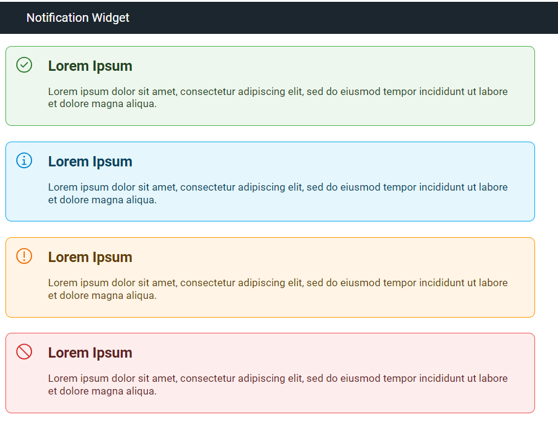

# Notification Widget (Sample)

A sample widget that displays info, success, warning, or error message.

## Sample Objectives:
This sample demonstrates the following:
- how to create a custom display widget using plain JavaScript and CSS
- how to define properties that contain a set of options for the app author
- how to define JavaScript API methods to be used by the app author for a more dynamic application

