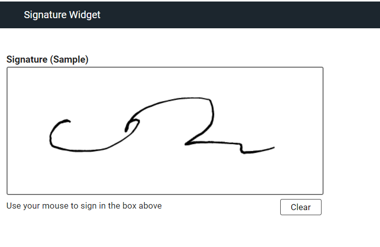

# Signature Widget (Sample)

A sample widget that collects a "scribble" signature from the user, utilizing the  [signature_pad](https://github.com/szimek/signature_pad) library.



## Sample Objectives
This sample demonstrates the following:
- how to create a custom widget that collects arbitrary data
- how to utilize a 3rd-party library in a custom widget, leveraging npm and webpack

## Build
1. Install `git` and `npm`  (consult the internet)
1. Open git bash console
2. Clone this repo. For example:  
 `git clone https://github.com/HCL-TECH-SOFTWARE/leap-custom-widgets.git`
1. `cd leap-custom-widgets/samples/signature-widget`
2. `npm install`
3. `npm run build`  

The output of the build will be in the `dist/` directory.
If you wish to make code changes to the sample, use `npm build-watch` to have the files building continuously. Refresh the browser to see recent changes.

## Run
Take the resulting files (.js, .css, and .svg) from the `dist/` directory and place onto a web server, or, if using VSCode, use the *Live Server* extension to make the files available by http. 

Now, configure Leap to load this .js file into its pages.

For example, for *HCL Leap* add the following to `Leap_config.properties`:
```properties
ibm.nitro.NitroConfig.runtimeResources.1 = \
<link rel='stylesheet' type='text/css' media='screen' href='http://127.0.0.1:5501/samples/signature-widget/dist/signature.css'> \n\
<script type='text/javascript' src='http://127.0.0.1:5501/samples/signature-widget/dist/signature.js'></script>
```
*HCL Domino Leap* configuration is done similarly by adding a config setting in `VoltConfig.nsf`. Consult product documentation for more information.


